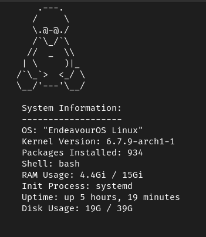

# Refetch

Refetch is a simple and elegant system information retrieval tool written in Bash.



## Features

- Display basic system information.
- Provides information such as hostname, operating system, kernel version, CPU, memory, disk usage, and uptime.

## Installation

To install Refetch, simply run the `install.sh` script provided in the repository:

```bash
git clone https://github.com/rebatnaath/refetch
cd refetch
./install.sh
